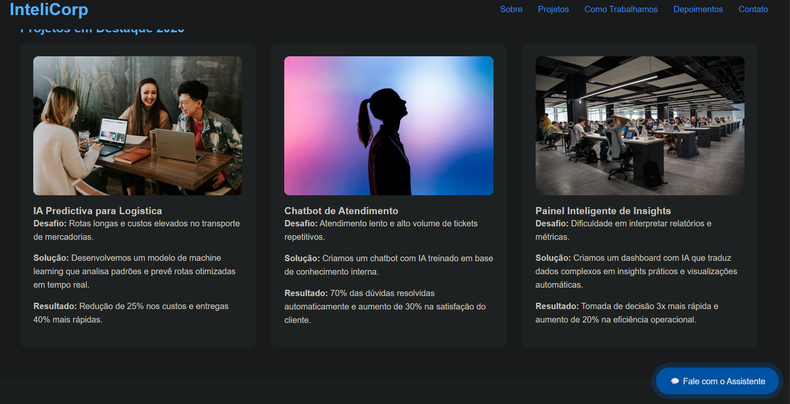
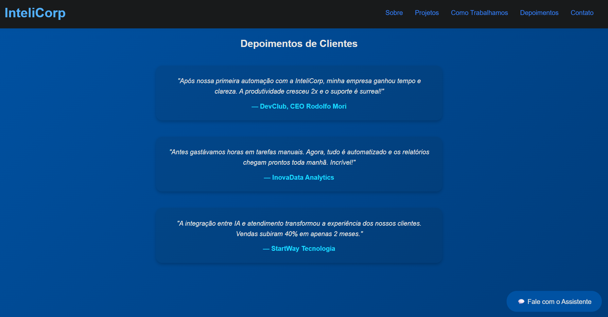

🧠 Descrição breve do projeto

Projeto 01 – Site Inteligente Corporativo
Este projeto apresenta um modelo de site moderno, limpo e interativo, criado com foco em empresas que desejam demonstrar seus projetos e diferenciais utilizando Inteligência Artificial e automações web.
O site inclui seções corporativas completas, chatbot simulado e elementos dinâmicos que tornam a experiência do usuário fluida e envolvente.

⚙️ Tecnologias utilizadas

HTML5 — estrutura semântica e responsiva

CSS3 — design minimalista com animações suaves

JavaScript (Vanilla) — interatividade e simulação de IA

Prompt Engineering — lógica de IA aplicada à experiência do usuário

Git & GitHub — versionamento e documentação do projeto

🖼️ Prints do resultado

### Prints do Resultado

🚀 Status do projeto

✅ Concluído – Versão 1.0
🔄 Futuras melhorias:

Integração real de chatbot com API

Formulário automatizado com Google Sheets

Versão em React para maior escalabilidade
